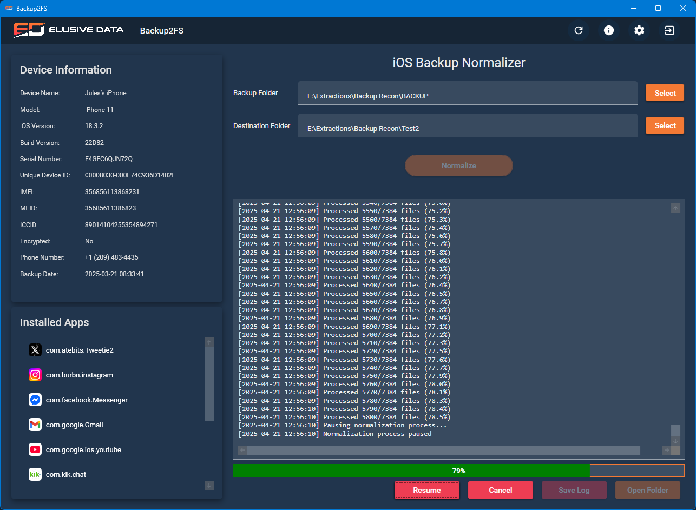
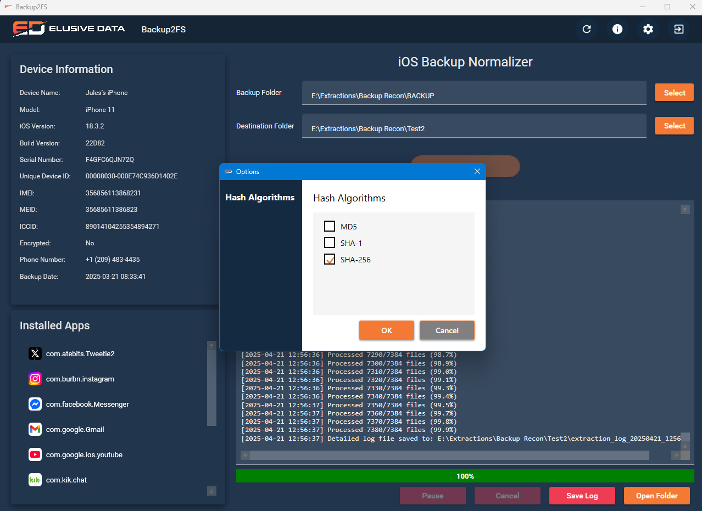
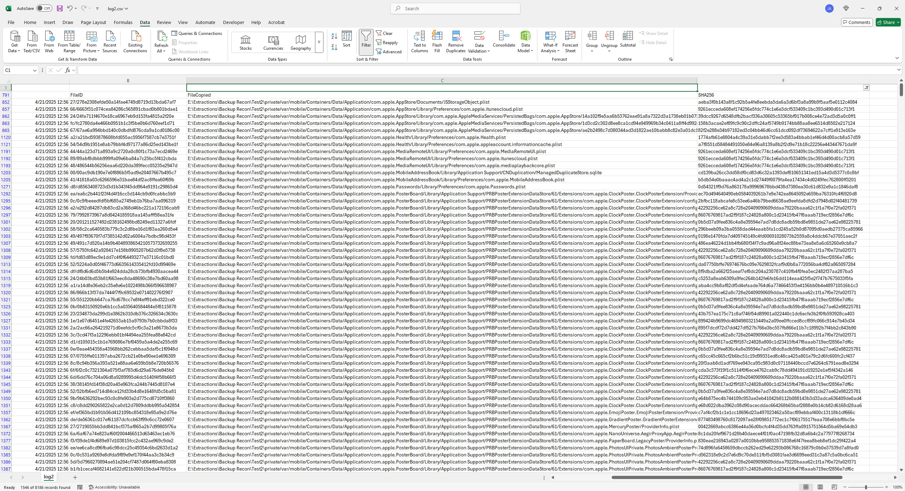
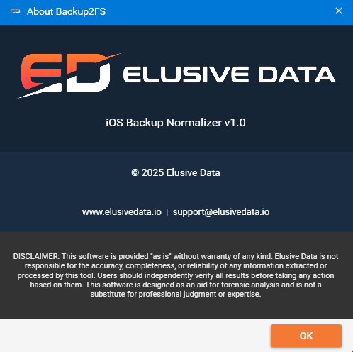

# Backup2FS

iOS Backup File Recovery and Normalization Tool

## Overview

Backup2FS is a Windows application designed to help recover and normalize iOS backup files. It allows you to extract and organize files from iOS device backups in a user-friendly way.



## Features

- Extracts files from iOS device backups
- Normalizes backup files into a standard file system format
- Supports multiple hash algorithms (MD5, SHA-1, SHA-256)
- Displays device information and installed apps
- Provides detailed logging of operations

## Screenshots

### Main Interface


### Hash Algorithm Selection


### Log Output


### About Dialog


## System Requirements

- Windows 10 or later
- .NET 7.0 or later
- 4GB RAM minimum (8GB recommended)
- 1GB free disk space plus space for the extracted backup files

## Installation

1. Download the latest release from the [Releases](https://github.com/eichbaumj/Backup2FS/releases) page
2. Extract the ZIP file to a location of your choice
3. Run `Backup2FS.exe` to start the application

## Usage

1. Click the "Select" button next to "Backup Folder" to choose the iOS backup folder
   - Usually located at `C:\Users\<username>\AppData\Roaming\Apple Computer\MobileSync\Backup\`
2. Click the "Select" button next to "Destination Folder" to choose where to save the extracted files
3. Click "Normalize" to begin the extraction process
4. View progress in the log window
5. Once complete, click "Open Folder" to view the extracted files

## Configuration

You can configure the hash algorithms used for file verification:
1. Click the Settings (gear) icon in the top-right corner
2. Select your preferred hash algorithms (MD5, SHA-1, SHA-256)
3. Click "OK" to save your preferences

## Build from Source

1. Clone the repository
   ```
   git clone https://github.com/eichbaumj/Backup2FS.git
   ```
2. Open the solution in Visual Studio 2022 or later
3. Restore NuGet packages
4. Build the solution

## Antivirus Notice

Some antivirus software, including Windows Defender on Windows 10, may flag the installer as suspicious (false positive). This is common with software installers and can be safely ignored. The application has been tested and is virus-free. 

Windows Defender on Windows 10 may specifically detect "Trojan:Win32/Wacatac.B!ml", which is a known false positive for Inno Setup installers. If you encounter this warning, you can:

1. Click "More info" and then "Run anyway" 
2. Add the installer to your antivirus exceptions
3. Use the portable version instead of the installer

This issue is less common on Windows 11, where the installer typically passes scans without warnings.

## License

Copyright © 2025 Elusive Data - All Rights Reserved

## Contact

For support or inquiries, please contact support@elusivedata.io 