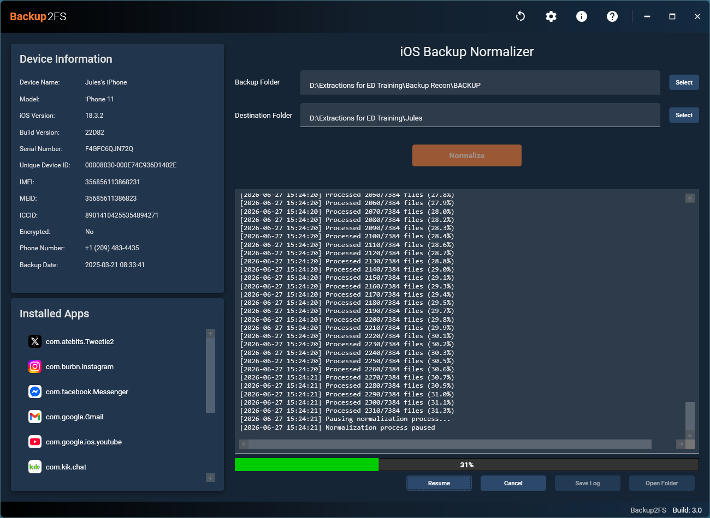
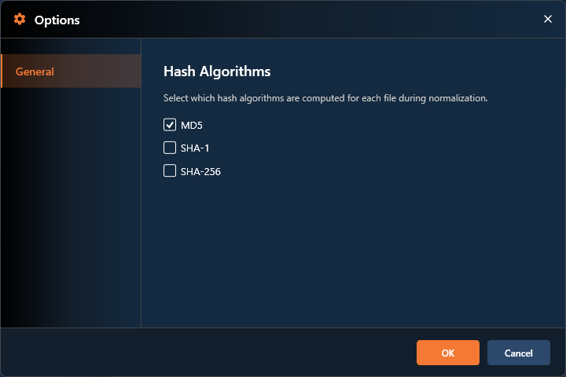
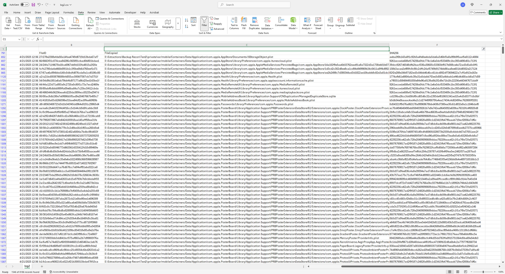
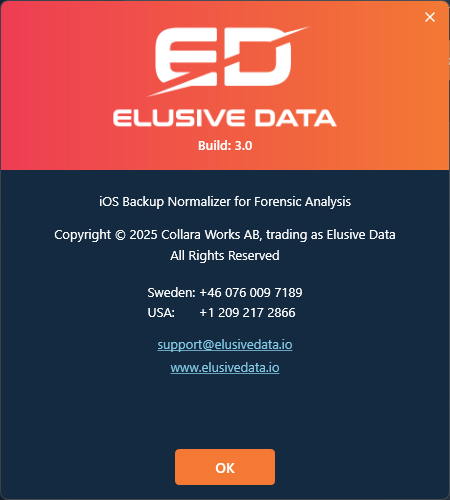

# Backup2FS

**Forensic iOS backup normalizer for Windows — decrypt encrypted backups and rebuild them into a browsable file system, with hash verification.**

By Elusive Data · Build 3.0

## Overview

An iTunes/Finder–style iOS backup stores every file under an opaque hashed name in a flat folder, indexed by a `Manifest.db` database. Backup2FS **normalizes** that backup back into the device's real folder structure (domains and relative paths), so you can browse and analyze it like an ordinary file system.

As of v3.0, Backup2FS also **decrypts encrypted backups in-app**: supply the iTunes/Finder backup password and it decrypts the backup and normalizes it in a single, seamless workflow — no separate decryption tool required.



## Features

- **Normalize iOS backups** — rebuilds the original file/folder structure from `Manifest.db` (iOS domains → real paths).
- **Decrypt encrypted backups** *(new in v3.0)* — detects an encrypted backup, prompts for the iTunes/Finder backup password, decrypts it, and normalizes in one flow. A decrypted copy of the backup is kept alongside the normalized output.
- **Hash verification** — computes MD5, SHA-1, and/or SHA-256 for every file (your choice).
- **Detailed forensic log (CSV)** — one structured row per entry: `Timestamp, Status, Domain, RelativePath, FileID, OutputPath, SizeBytes, MD5, SHA1, SHA256`, where `Status` is `Copied` / `Directory` / `Symlink` / `Missing` / `Error`.
- **Device information & installed apps** — parsed from the backup and displayed.
- **Read-only on the source** — the original backup is opened read-only and never modified (forensic integrity).
- **Pause, resume, and cancel** during processing.
- **Modern dark interface** with a clean, distraction-free workflow.

## Screenshots

### Main Interface


### Options — Hash Algorithm Selection


### Log Output


### About


## System Requirements

- Windows 10 or Windows 11 (64-bit)
- No separate .NET install required — the installer is self-contained (the .NET runtime is bundled)
- 4 GB RAM minimum (8 GB recommended)
- Free disk space for the normalized output (and, for encrypted backups, the decrypted copy)

## Installation

1. Download the latest installer from the [Releases](https://github.com/eichbaumj/Backup2FS/releases) page.
2. Run the installer and follow the prompts.
3. Launch **Backup2FS** from the Start menu or desktop shortcut.

## Usage

1. **Select Backup Folder** — the iOS backup directory (the folder containing `Manifest.db` and `Manifest.plist`).
   - iTunes/Finder backups are usually under `…\Apple Computer\MobileSync\Backup\` or `…\Apple\MobileSync\Backup\`.
2. **If the backup is encrypted**, a prompt appears — enter the iTunes/Finder backup password. Device details then load.
3. **Select Destination Folder** — where the normalized file system will be written.
4. Click **Normalize**. For an encrypted backup this decrypts first (into `<Destination>_DecryptedBackup`) and then normalizes.
5. Watch progress in the log, then click **Open Folder** when it completes.

The detailed CSV log (`extraction_log_<timestamp>.csv`) is written to the destination folder, and **Save Log** exports a human-readable report.

## Configuration

Open **Settings** (gear icon) to choose which hash algorithms (MD5 / SHA-1 / SHA-256) are computed for each file.

## Build from Source

Requires the **.NET 7 SDK**.

```bash
git clone https://github.com/eichbaumj/Backup2FS.git
```

Open `Backup2FS.sln` in Visual Studio 2022 (or run `dotnet build`), restore NuGet packages, and build.

## Antivirus Notice

Some antivirus software, including Windows Defender on Windows 10, may flag the installer as suspicious (false positive). This is common with software installers and can be safely ignored. The application has been tested and is virus-free.

Windows Defender on Windows 10 may specifically detect "Trojan:Win32/Wacatac.B!ml", a known false positive for Inno Setup installers. If you encounter this warning, you can:

1. Click "More info" and then "Run anyway", or
2. Add the installer to your antivirus exceptions.

This issue is less common on Windows 11, where the installer typically passes scans without warnings.

## Acknowledgements

The encrypted-backup decryption is based on the approach in [jsharkey13/iphone_backup_decrypt](https://github.com/jsharkey13/iphone_backup_decrypt) (itself derived from the *iphone-dataprotection* project).

## License

Copyright © 2025–2026 Collara Works AB, trading as Elusive Data — All Rights Reserved.

## Contact

Support: support@elusivedata.io · <https://www.elusivedata.io>
